# Sanbella — Sistema Web de Reservas

Frontend del sistema de reservas de citas Sanbella. Implementación de los tres requerimientos solicitados como parte de la evaluación técnica para LVL Consulting:

1. **Registro de reserva** — flujo de creación de nuevas reservas
2. **Confirmación de reserva** — lógica para validar/confirmar las mismas
3. **CRUD de Usuario** — operaciones básicas de administración de usuarios

Las funcionalidades fueron implementadas siguiendo fielmente las historias de usuario del documento funcional (HU-SEG-002, HU-SEG-003, HU-OPER-002, HU-OPER-005) y las restricciones reales del backend descubiertas en el Swagger.

---

## Tabla de contenidos

- [Stack tecnológico](#stack-tecnológico)
- [Arquitectura](#arquitectura)
- [Instalación y ejecución](#instalación-y-ejecución)
- [Estructura del proyecto](#estructura-del-proyecto)
- [Funcionalidades implementadas](#funcionalidades-implementadas)
- [Capturas](#capturas)
- [Rutas](#rutas)
- [Decisiones técnicas](#decisiones-técnicas)
- [Limitaciones del backend descubiertas](#limitaciones-del-backend-descubiertas)
- [Convenciones de código](#convenciones-de-código)
- [Contacto](#contacto)

---

## Stack tecnológico

| Capa | Tecnología | Versión |
|---|---|---|
| Lenguaje | TypeScript (strict mode) | 5.5 |
| Build | Vite | 5.4 |
| UI | React | 18.3 |
| Routing | React Router | 6.26 |
| HTTP | Axios | 1.7 |
| Server state | TanStack Query | 5.56 |
| Client state | Zustand | 5.0 |
| Forms | React Hook Form | 7.53 |
| Validation | Zod | 3.23 |
| Styling | Tailwind CSS | 3.4 |
| Date utils | date-fns | 3.6 |
| Icons | Lucide React | 0.447 |

---

## Arquitectura

Aplicación organizada en **capas claras** siguiendo principios de Clean Architecture adaptados al stack de React:

```
┌─────────────────────────────────────────┐
│  Pages (UI / Orquestación)              │
│  └─ Componentes presentacionales        │
├─────────────────────────────────────────┤
│  Hooks (Lógica de aplicación)           │
│  └─ TanStack Query + casos de uso       │
├─────────────────────────────────────────┤
│  API (Infraestructura HTTP)             │
│  └─ axios + interceptors                │
├─────────────────────────────────────────┤
│  Types (Dominio)                        │
│  └─ Contratos del backend               │
└─────────────────────────────────────────┘
```

**Principios aplicados:**

- **Separación de responsabilidades** — cada capa tiene un único motivo de cambio
- **Co-locación** dentro de features — modales, schemas y subcomponentes viven junto a la página que los usa
- **Tipado estricto** — `strict: true` en TypeScript, validaciones con Zod en runtime
- **Datos del API como única fuente de verdad** — catálogos cargados dinámicamente, nada hardcodeado

---

## Instalación y ejecución

### Requisitos

- Node.js >= 18
- npm o yarn

### Pasos

```bash
# Instalar dependencias
npm install

# Modo desarrollo (http://localhost:3000)
npm run dev

# Verificación de tipos
npm run type-check

# Build de producción
npm run build

# Preview del build de producción
npm run preview
```

### Variables de entorno

El backend está configurado por defecto a `http://ec2-16-59-188-126.us-east-2.compute.amazonaws.com:9323/sanbella-web-api`. Para apuntar a otro servidor, crear un archivo `.env`:

```env
VITE_API_URL=https://tu-backend.com/sanbella-web-api
```

### Credenciales de prueba

```
Correo:     admin@sanbella.com
Contraseña: Admin1234
```

---

## Estructura del proyecto

```
src/
├── api/                          # Capa HTTP — axios + endpoints
│   ├── axiosInstance.ts          # Cliente + interceptors (auth, 401)
│   ├── authApi.ts                # Endpoints de autenticación
│   ├── reservaApi.ts             # Endpoints de reservas, portal y catálogos
│   ├── usuarioApi.ts             # Endpoints de usuarios
│   └── usuarioServicioApi.ts     # Asignación servicios-especialistas
│
├── hooks/                        # Capa de aplicación — TanStack Query
│   ├── useReservas.ts            # Hooks para CRUD de reservas + catálogos
│   └── useUsuarios.ts            # Hooks para CRUD de usuarios
│
├── types/                        # Capa de dominio — contratos del API
│   └── index.ts                  # Todas las interfaces del backend
│
├── utils/                        # Utilidades transversales
│   ├── apiHelpers.ts             # fromCombo, cleanFilters, etc.
│   └── helpers.ts                # formatDate, formatCurrency, getApiError
│
├── components/                   # Componentes UI compartidos
│   ├── ui/                       # Design system (Modal, Toast, Pagination...)
│   └── Layout/AdminLayout.tsx    # Layout del panel admin con sidebar
│
├── pages/                        # Vistas
│   ├── Login/
│   │   ├── LoginPage.tsx
│   │   ├── ForgotPasswordPage.tsx
│   │   └── CambiarPasswordPage.tsx
│   ├── Dashboard/DashboardPage.tsx
│   ├── Reservas/
│   │   ├── NuevaReservaPage.tsx        # Orquestador del wizard
│   │   ├── nueva-reserva/              # Pasos del wizard
│   │   │   ├── StepIndicator.tsx
│   │   │   ├── StepServicio.tsx
│   │   │   ├── StepHorario.tsx
│   │   │   ├── StepDatos.tsx
│   │   │   ├── StepResumen.tsx
│   │   │   ├── StepExito.tsx
│   │   │   └── nuevaReserva.utils.ts
│   │   ├── ConfirmarReservaPage.tsx
│   │   ├── ReservaDetallePage.tsx
│   │   ├── ReservasListPage.tsx
│   │   ├── InfoRow.tsx                  # Componente compartido
│   │   ├── AdelantoModal.tsx
│   │   ├── PagoModal.tsx
│   │   └── AnularReservaModal.tsx
│   ├── Agenda/
│   │   ├── AgendaPage.tsx               # Orquestador
│   │   ├── AccionesCita.tsx
│   │   ├── AnularModal.tsx
│   │   ├── ReagendarModal.tsx
│   │   ├── CalendarView.tsx
│   │   └── agenda.utils.ts
│   └── Usuarios/
│       ├── UsuariosListPage.tsx
│       ├── UsuarioFormModal.tsx
│       ├── PasswordInput.tsx
│       └── usuario.schema.ts
│
├── store/                        # Estado global con Zustand
│   └── authStore.ts              # Auth (token + user info)
│
└── router/
    └── AppRouter.tsx             # Configuración de rutas
```

---

## Funcionalidades implementadas

### 1. Registro de reserva (HU-OPER-002)

**Ruta:** `/book` (portal público)

Wizard de 4 pasos para que un cliente invitado agende una cita:

| Paso | Pantalla |
|---|---|
| 1 | Selección de **categoría** y **servicio** (muestra nombre, descripción, precio, duración) |
| 2 | Selección de **fecha** (máx. 15 días), **especialista** (con opción "Cualquiera / Predeterminado") y **horario disponible** |
| 3 | Datos del **invitado** (nombre, apellido, celular, correo) y campo de **código de validación** |
| 4 | **Resumen** + botón de Confirmar |
| 5 | **Éxito** con **código de verificación** generado |

**Criterios de aceptación cumplidos:**
- ✅ Vista de servicios con Nombre, Descripción, Precio, Duración
- ✅ Selector de Especialista con trabajadores asignados al servicio + opción "Cualquiera"
- ✅ Calendario con días bloqueados (fuera de los 15 días o pasados)
- ✅ Solicita Nombre, Apellido, Celular, Correo para invitados
- ✅ Campo de código de validación
- ✅ Resumen previo a confirmar
- ✅ Reserva creada en estado PENDIENTE

### 2. Confirmación de reserva

**Ruta:** `/reservations/confirm` (admin)

Flujo del recepcionista para gestionar una reserva por su código de verificación:

1. **Búsqueda** por código (ej. `SAN-47CCQI`) → `GET /api/reserva/getByCodigoVerificacion/{codigo}`
2. **Vista de detalle** con cliente, servicio, especialista, fecha/hora, estado, monto
3. **Acciones disponibles** según el estado actual:

| Acción | Estado requerido | Endpoint |
|---|---|---|
| Confirmar adelanto | PENDIENTE | `PATCH /api/reserva/updateConfirmarAdelanto/{id}` |
| Registrar asistencia | ADELANTADO/CONFIRMADA | `PATCH /api/reserva/updateAsistencia/{id}` |
| Registrar pago | EN PROCESO/EN ATENCIÓN | `PATCH /api/reserva/updateRegistrarPago/{id}` |
| Anular | Cualquiera | `PATCH /api/reserva/updateAnular/{id}` |

Los botones se **habilitan/deshabilitan según el estado real de la reserva**, evitando llamadas que el backend rechazaría.

### 3. CRUD de Usuario (HU-SEG-003)

**Ruta:** `/users`

Administración completa de usuarios del sistema:

- **Crear** — modal con validaciones Zod (mín. 8 caracteres, mayúscula, número, carácter especial)
- **Leer** — tabla paginada con búsqueda por nombre + filtros por rol y estado
- **Actualizar** — modal de edición (incluye reset opcional de contraseña; asignación de servicios para especialistas)
- **Eliminar** — toggle `habilitado` (soft-delete del backend) con badge "Inhabilitado"
- **Acciones adicionales:**
  - 🗝️ Generar nueva contraseña (envío al correo del usuario)
  - 🛡️ Levantar bloqueo / suspensión (cuando el usuario está en estos estados)

**Estados de usuario** cargados dinámicamente desde el catálogo `GET /api/comun/loadCatalogo/ESTADO_USUARIO`:

- `USU001` → Activo
- `USU002` → Inactivo
- `USU003` → Bloqueado
- `USU004` → Suspendido

---

## Capturas

> Las imágenes se encuentran en `docs/screenshots/`. Reflejan las pantallas principales de las tres funcionalidades evaluadas.

### Autenticación

**Login**
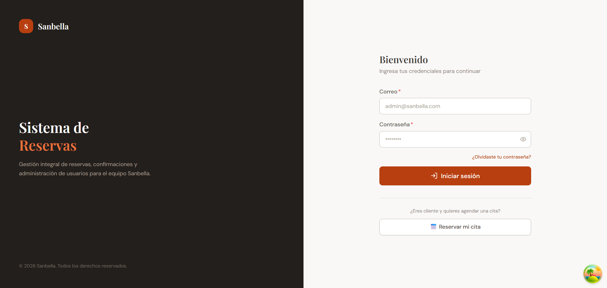

### Registro de reserva (HU-OPER-002)

**Portal público — `/book`**

Paso 1 · Selección de servicio (categoría, servicio, precio, duración, descripción)
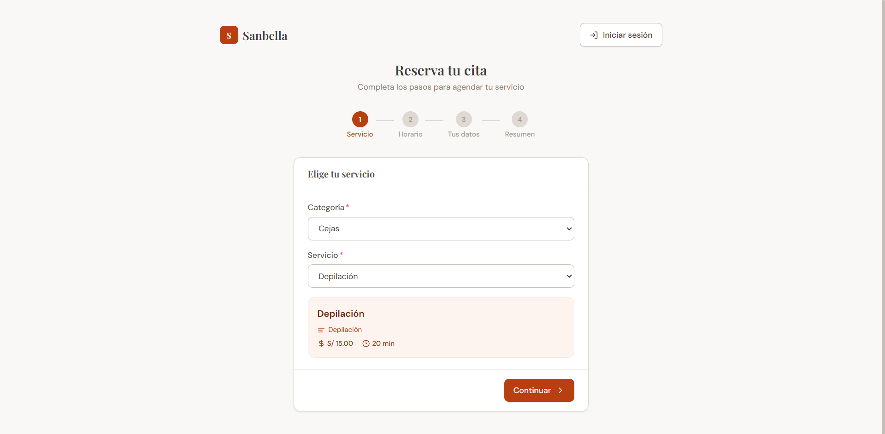

Paso 2 · Fecha, especialista y horario disponible
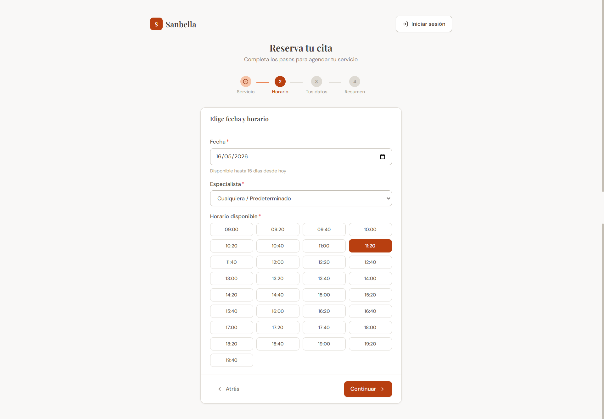

Paso 3 · Datos del invitado
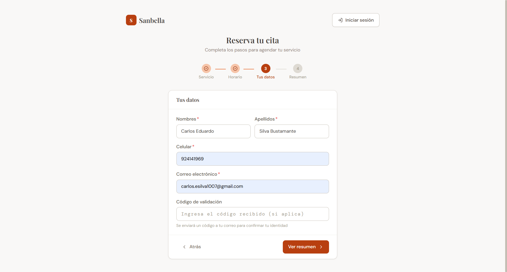

Paso 4 · Resumen y confirmación
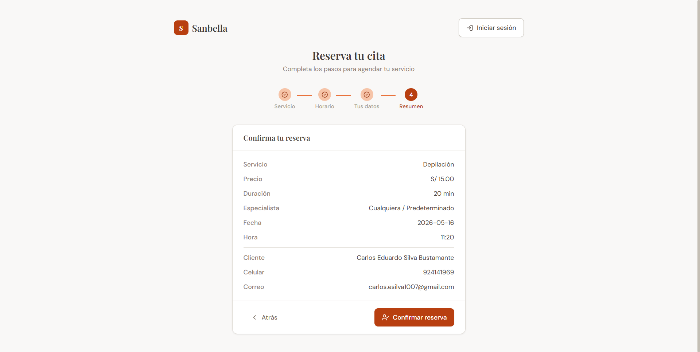

Paso 5 · Éxito con código de verificación
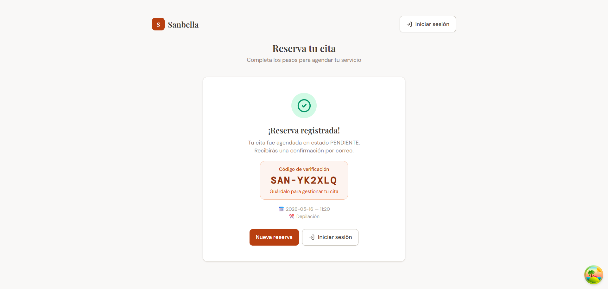

### Confirmación de reserva

**Búsqueda por código y acciones del recepcionista**
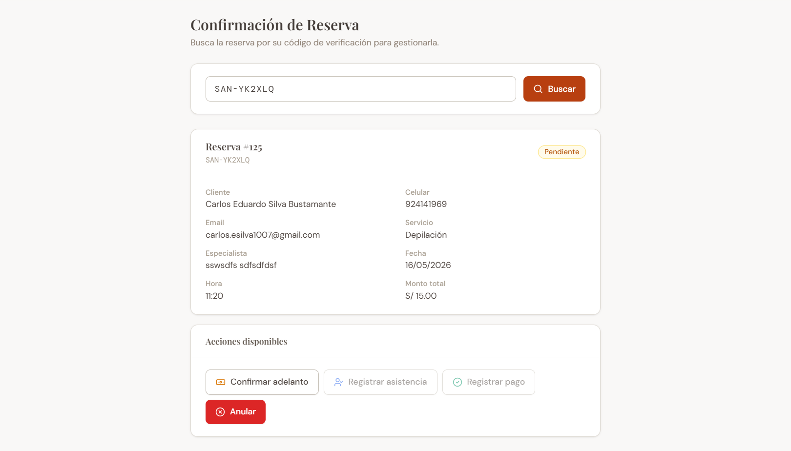

**Acciones disponibles según el estado**
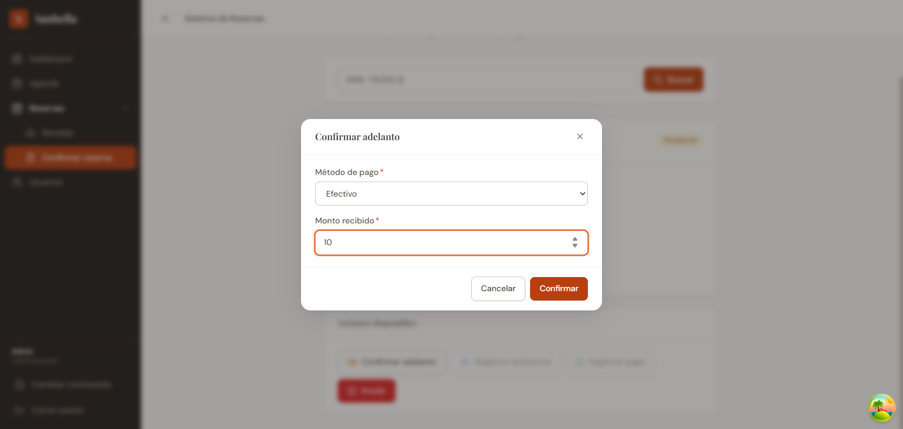

### CRUD de Usuario (HU-SEG-003)

**Bandeja con filtros y paginación numerada**
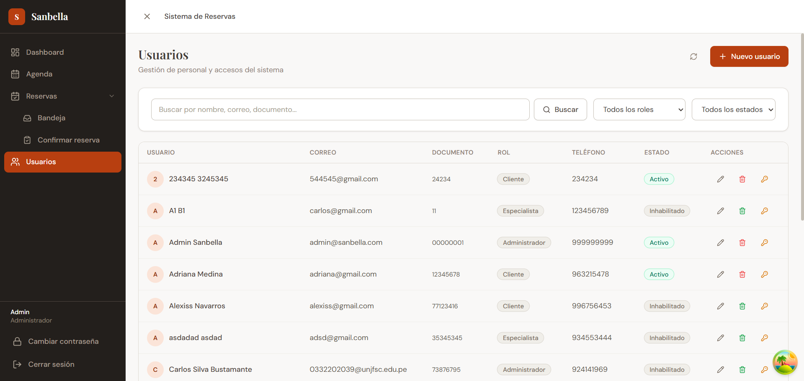

**Modal de creación / edición**
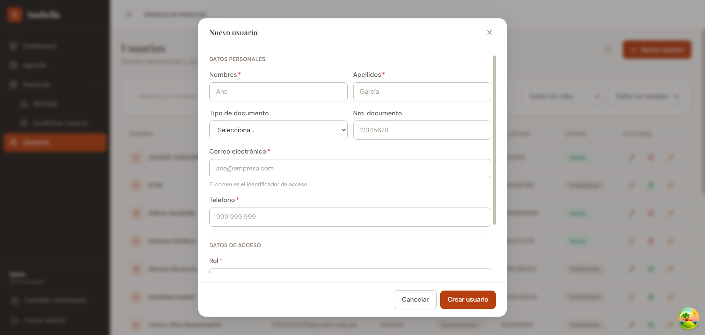

### Bonus

**Agenda con vista tabla y calendario semanal (HU-OPER-005)**
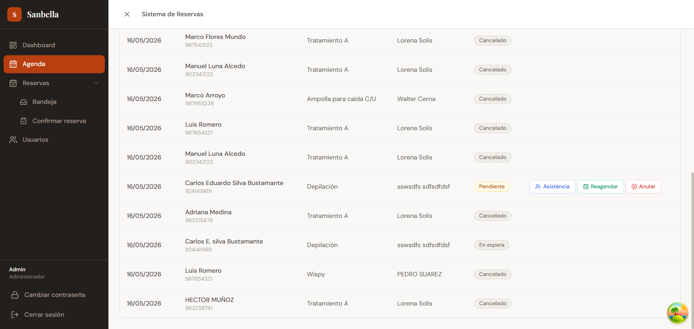
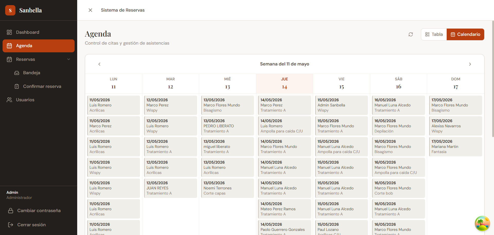

**Dashboard con métricas en tiempo real**
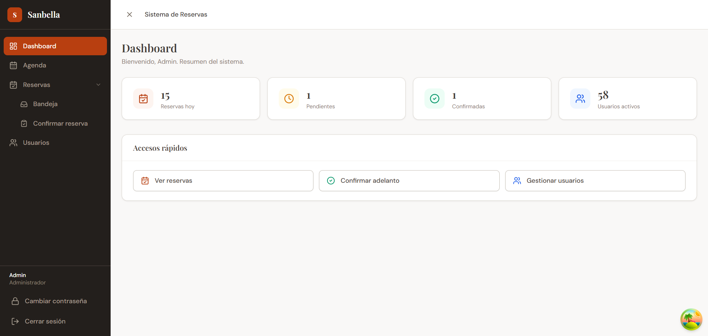

---

## Rutas

### Públicas (sin autenticación)

| Ruta | Página | Descripción |
|---|---|---|
| `/login` | LoginPage | Inicio de sesión |
| `/forgot-password` | ForgotPasswordPage | Recuperar contraseña por correo |
| `/book` | NuevaReservaPage | Portal de reservas para clientes |

### Protegidas (requieren login)

| Ruta | Página | Descripción |
|---|---|---|
| `/dashboard` | DashboardPage | Resumen con métricas |
| `/schedule` | AgendaPage | Agenda diaria/semanal (HU-OPER-005) |
| `/reservations` | ReservasListPage | Bandeja general de reservas |
| `/reservations/:id` | ReservaDetallePage | Detalle de reserva |
| `/reservations/confirm` | ConfirmarReservaPage | Gestión por código |
| `/users` | UsuariosListPage | CRUD de usuarios |
| `/profile/change-password` | CambiarPasswordPage | Cambiar contraseña |

---

## Decisiones técnicas

### 1. Tres fuentes de verdad correctamente separadas

- **Server state** (datos del backend) → **TanStack Query**: cache, invalidación, refetch automático
- **Client state** persistente (auth) → **Zustand** con `localStorage`
- **Form state** → **React Hook Form** + Zod para validación tipada

### 2. Interceptor de axios con manejo inteligente de auth

- Las llamadas a `/api/auth/*` **nunca** envían el token (ni siquiera si existe uno expirado)
- Los demás endpoints adjuntan el token automáticamente si está disponible
- Si recibo `401`, **solo redirijo a `/login` si NO estoy en una ruta pública** (`/login`, `/forgot-password`, `/book`) — evita el bucle de redirect cuando el portal pierde el token

### 3. Catálogos del API como única fuente de verdad

Los estados de reserva (`RES001`, `RES002`...) y de usuario (`USU001`...) se cargan dinámicamente del backend con `staleTime: Infinity`. Si mañana el backend renombra "Pendiente" a "Por confirmar", el frontend se ajusta solo, sin tocar código.

### 4. Paginación numerada inteligente

Componente `<Pagination>` reutilizable con elipsis para datasets grandes:
```
‹ 1 … 4 [5] 6 … 20 ›
```

### 5. Toast system co-locado (sin librerías externas)

Hook `useToast()` + componente `<ToastContainer>` propios (~60 líneas). Auto-dismiss a los 3.5s, soporta success/error, ubicación superior derecha.

### 6. Refactor por composición

Cada página grande (>400 líneas) se refactorizó extrayendo:
- **Subcomponentes** para vistas independientes (steps del wizard, vista de calendario)
- **Modales** como componentes autocontenidos con su propio schema/form
- **Utilidades** (date helpers, transformadores de respuesta) en archivos `*.utils.ts`
- **Schemas Zod** en archivos `*.schema.ts`

Resultado:

| Página | Antes | Después |
|---|---|---|
| `AgendaPage.tsx` | 700 líneas | 280 |
| `NuevaReservaPage.tsx` | 400 líneas | 125 |
| `UsuariosListPage.tsx` | 460 líneas | 310 |
| `ConfirmarReservaPage.tsx` | 330 líneas | 200 |

### 7. Sidebar con navegación jerárquica

El sidebar usa un patrón de grupos colapsables tipados con union types (`NavLeaf | NavGroup`):
- Detecta automáticamente la ruta activa para mantener abierto el grupo correspondiente
- En modo compacto degrada graciosamente a un atajo directo al primer hijo
- Agregar nuevos grupos es declarativo

---

## Limitaciones del backend descubiertas

Durante la implementación, revisando el Swagger contra los requisitos de las HUs, identifiqué cuatro puntos donde el backend define un comportamiento distinto al que la HU sugiere:

### 1. Reserva como invitado requiere autenticación

La sección "Portal Público" del Swagger incluye `POST /api/findDisponibilidad` y `POST /api/saveOrUpdateReserva`, pero ambos **rechazan con 401** si no se envía un token. La HU-OPER-002 indica que un invitado debería poder reservar enviando un código de validación recibido por correo, pero el schema `ReservaRequest` no incluye campo `codigoValidacion`. En consecuencia, el frontend muestra el campo (cumpliendo la HU visualmente) pero el backend lo ignora.

### 2. Soft-delete de usuario en lugar de borrado real

`DELETE /api/usuario/delete/{id}` está documentado como *"Habilitar o deshabilitar usuario"* — es un toggle del campo `habilitado`, no un borrado. El frontend lo refleja:
- Icono de papelera → tooltip "Deshabilitar usuario" / "Habilitar usuario"
- Badge "Inhabilitado" cuando `habilitado: false`

### 3. Workflow de reserva exige perfil Especialista

El backend requiere que entre "EN ESPERA" (asistencia registrada) y "PAGADO" (cobro) intervenga el perfil **Especialista** vía `PATCH /api/ejecucion/updateIniciar/{ejecucionId}` y `updateFinalizar`. Como el módulo Ejecución no es parte del alcance de las 3 features evaluadas, el botón "Registrar pago" se mantiene deshabilitado en estado EN ESPERA con un mensaje informativo al recepcionista.

### 4. `saveOrUpdate` de usuario ignora `estadoCodigo`

Aunque `UsuarioRequest` define `estadoCodigo: string`, el backend lo ignora silenciosamente y responde "success" sin actualizar. Los cambios de estado se gestionan exclusivamente con los endpoints dedicados (`delete` toggle y `suspension`). El frontend lo refleja mostrando el estado en modo lectura dentro del modal de edición.

---

## Convenciones de código

- **Strict TypeScript** en todo el proyecto (`strict: true`)
- **No `any`** salvo en castings explícitos justificados (`Record<string, unknown>` preferido)
- **Imports absolutos** con alias `@/` configurado en Vite
- **Validación de formularios** siempre tipada con `useForm<z.infer<typeof schema>>()`
- **Schemas Zod** co-locados con el componente que los usa (o en archivos `.schema.ts` cuando son compartidos)
- **Hooks personalizados** para cualquier mutación o consulta — nunca llamadas directas a axios desde un componente
- **Mensajes y catálogos en español** consistentes con el dominio

---

## Cumplimiento de HUs

| HU | Título | Estado |
|---|---|---|
| HU-SEG-002 | Gestión de Acceso | ✅ Implementado |
| HU-SEG-003 | Mantenimiento de Usuario | ✅ Implementado |
| HU-OPER-002 | Registro de Reservas | ✅ Implementado |
| HU-OPER-005 | Control de Agenda | ✅ Implementado |

---

## Contacto

Si tienes alguna pregunta o sugerencia, puedes encontrarme en:

- 🌐 [Mi GitHub](https://github.com/carlossilvadev10)
- 📧 Email: [carlos.esilva1007@gmail.com](mailto:carlos.esilva1007@gmail.com)
- 💼 [Mi LinkedIn](https://www.linkedin.com/in/carlos-eduardo-silva-bustamante-b6084528b)

---

Desarrollado como parte de la evaluación técnica para **LVL Consulting / Sanbella** — Mayo 2026
